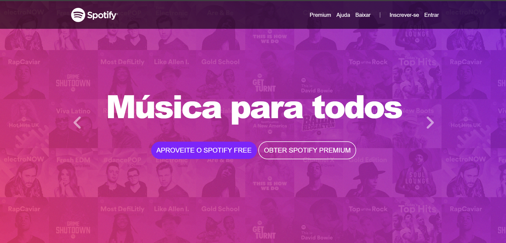

# 🎧 Clone Spotify

Projeto desenvolvido com foco em replicar a interface do Spotify, utilizando HTML, CSS, JavaScript e Bootstrap. 
A proposta foi criar uma página visualmente semelhante à plataforma original, explorando conceitos de layout responsivo, design moderno e componentização com Bootstrap.

  

********
## 🛠️ Tecnologias utilizadas

  
  
  
  

*****
### ✨ Funcionalidades
- Layout inspirado na interface do Spotify
- Menu lateral fixo com ícones
- Área de navegação com playlists e sugestões
- Estilização responsiva para diferentes tamanhos de tela
- Interações simples com JavaScript

### 🚀 Deploy 

Você pode visualizar o projeto online:

🔗 https://nandacoderdev.github.io/clone-spotify/

